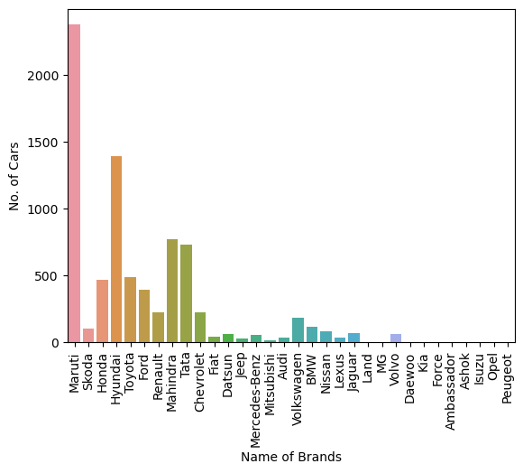
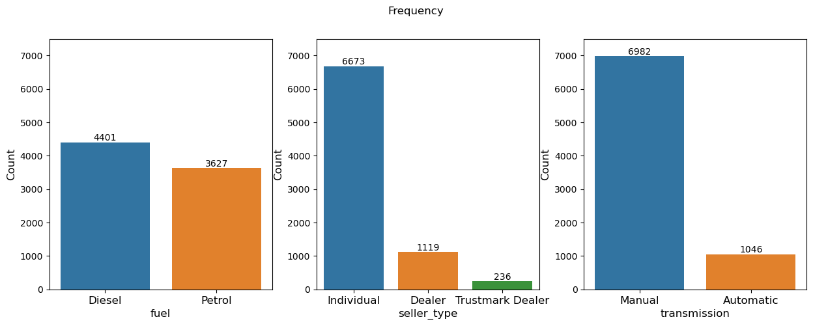
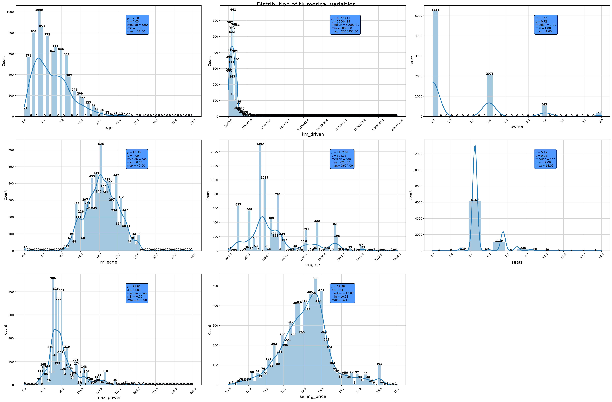
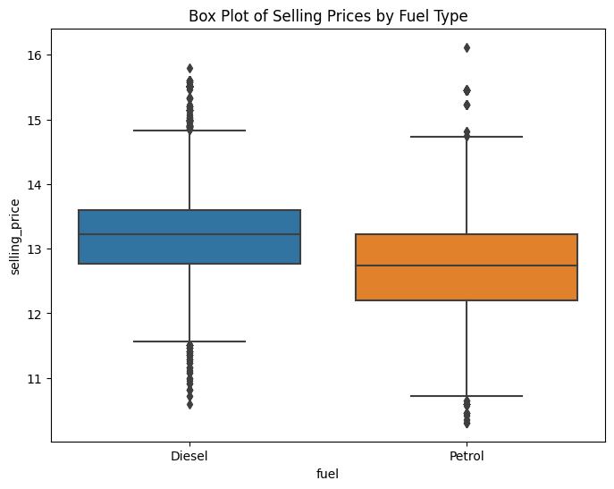
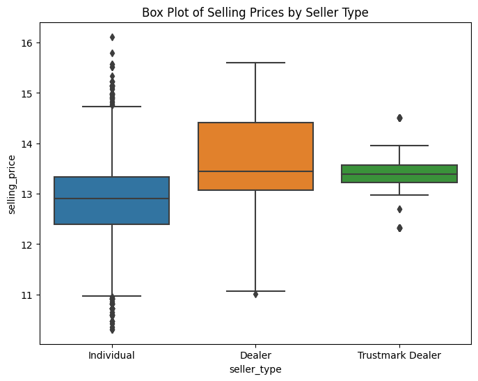
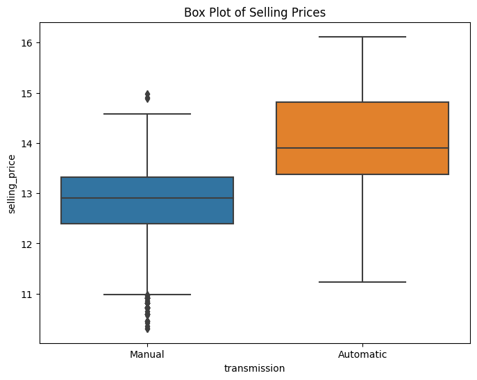
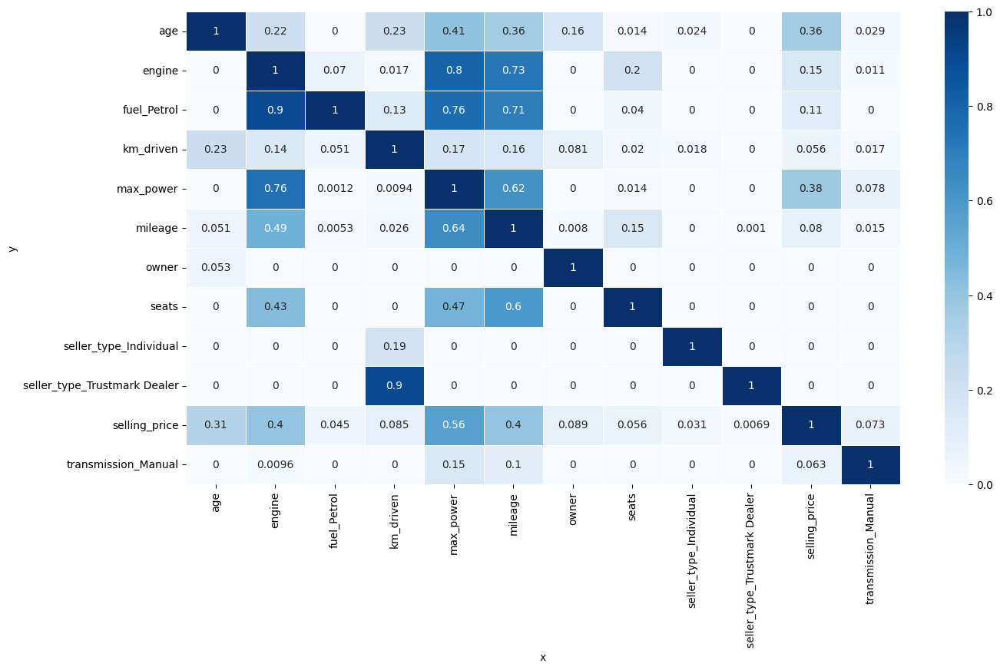

## Project A1: Predicting Car Price

## Overview

The project's primary objective is to develop a predictive model to determine the selling prices of cars, culminating in a user-friendly, web-based price prediction system.

## Dataset and Features


### Dataset Description

The dataset provided contains various features related to cars, including:

**Name:** Brand name of the car.

**Year:** Year of manufacture.

**Selling Price:** Price at which the car is being sold.

**Km Driven:** Total kilometers driven by the car.

**Fuel:** Type of fuel used by the car.

**Seller Type:** Type of seller (Individual, Dealer, etc.).

**Transmission:** Transmission type of the car (Manual, Automatic).

**Owner:** Number of previous owners.

**Mileage:** Car's mileage.

**Engine:** Size of the engine.

**Max Power:** Maximum power of the car.

**Torque:** Torque of the engine.

**Seats:** Number of seats in the car.

## Preprocessing

The raw data requires specific preprocessing steps which are outlined in the notebook.

## Libraries Used

Numpy
Pandas
Seaborn
Matplotlib
Scikit-learn

## Notebook Contents

Introduction and Dataset Description
Library Importation
Data Preprocessing and Exploration
Model Development and Evaluation
Conclusion and Recommendations for Deployment


## Data Preprocessing
Key preprocessing steps include dummy encoding for categorical variables, ensuring compatibility with machine learning algorithms.

## Exploratory Data Analysis (EDA)

The EDA process involved both univariate and multivariate analyses, leveraging tools like Seaborn for visualizing and understanding the data distribution and relationships between variables.









## Predictive Power Score


**Age:**

Has a PPS of 0.36 with respect to selling_price, suggesting a moderate predictive relationship where the age of a car can help predict its selling price.

**Engine:**

Has a significant PPS of 0.8 with max_power, indicating that the size of the engine is highly predictive of the car's power output.

**Fuel_Petrol:**

Shows a PPS of 0.9 with engine, which is expected.

**Km_Driven:**

Has a low PPS with respect to selling_price (0.05), suggesting it is not a strong predictor of the selling price on its own.

**Max_Power:**

Shows a PPS of 0.38 with selling_price, indicating a reasonably strong predictive power on the selling price.
Has a PPS of 0.76 with engine, further confirming the strong relationship between engine size and max power.

**Milage:** 

Show low PPS of 0.08 with selling_price

**Seats:**

Shows a good predictive relationship with engine (0.43), indicating that the number of seats might predict the engine size, possibly due to larger cars with more seats having bigger engines.

**Seller_Type (Individual and Trustmark Dealer):**

Both show low PPS scores with respect to selling_price, suggesting that seller type might not be a strong predictor of selling price in isolation.


##  Feature Selection

Important features for the model were chosen based on their predictive power and relevance to the selling price, including factors like kilometers driven, max power, age, fuel and engine size.


## Model Development and Evaluation
**Random Forest Model**
Rationale: Random Forest was selected as the best model due to its robustness and accuracy in handling datasets with diverse features and complex relationships.
Performance Evaluation: The model's performance was assessed using metrics like Mean Squared Error (MSE) and R² Score. R


**Mean Squared Error (MSE): 0.0968**
**R-squared (R2) Score: 0.86233**

The MSE measures the average squared difference between the predicted and actual selling prices. A lower MSE indicates better model performance.

The R-squared (R2) score measures the proportion of the variance in the target variable (selling prices) that is explained by the model. In this case, the model explains approximately 86.23% of the variance in selling prices, which indicates a good fit to the data.


## Dash Deployment


All the files reqiured for setting up Dash deployment are in ```app/code``` directory. Need to open the terminal and navigate to the directory ```app/code```. Finally run the below command.

 ```
 python main.py
 ```

 Then, access the Dash Application: Once the script is running, open a web browser and visit **http://localhost:9001/**  to access the car selling price prediction web application.


 ### Docker Compose to run the app in a Docker container
Need to open terminal or command prompt and navigate to ```app`` directory where the docker-compose.yml and Dockerfile are located. And run the below command 


``````sh
docker compose up --build

```````

Access the app with **http://localhost:9001**


**Conclusion and Recommendations:**


In conclusion, the Random-Forest Regressor outperforms the other algorithms due to its ability to average out the errors of individual trees, thereby reducing overfitting and improving generalization to new data. The less well-performing algorithms, such as Linear Regression and Decision-Tree Regressor, might be suffering from either oversimplification of the problem or overfitting to the training data. The choice of algorithm should always be based on the specific characteristics of the data and the underlying patterns that need to be modeled.


